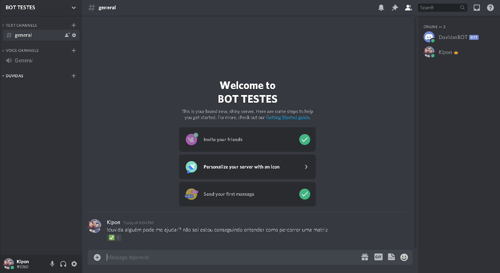

# Dúvidas Bot

<h2> Bot para discord que organiza dúvidas em salas, para facilitar o trabalho em com alunos de forma virtual.</h2>

<h2> Desenvolvido em Java, utilizando Maven para gerenciar as dependências.</h2>

## To-do:
 * Há a possibilidade de adicionar estatísticas, e um painel de informações de cada aluno, suas dificuldades etc.
 * Alunos poderem ajudar outros alunos.
 * Monitores e outros alunos poderem ser convidados a sala de uma dúvida.

## Bibliotecas utilizadas:
  * JDA - [Java Discord API] (https://github.com/DV8FromTheWorld/JDA)
  * Hibernate - Para persistência de dados.
  * SQLite - Como banco de dados.

## Como funciona: 
> + Aluno digita no chat um comando: !duvida {duvida aqui}
O bot automaticamente reage a mensagem com uma mão levantada. 

> + Para responder a dúvida, você precisa estar com cargo de monitor no servidor.
e basta clicar pra reagir a mensagem de dúvida. 
Caso outro usuário responda, nada acontece, pelo menos por enquanto só há essas opções. 

> + Quando um monitor aceita a dúvida, ela é automaticamente reagida com um emoji simbolizando que já foi respondida. 
E é criada uma nova sala privada ao lado, só para o monitor e o aluno. 

> + A sala é criada, já com essa mensagem que tem a dúvida do aluno para facilitar. 

> + Você pode conversar, respondendo tudo certinho, e logo após, qualquer um dos dois, o aluno ou o monitor, podem usar o comando !finalizar, que finaliza a sala e conclui o atendimento. 

> + E pronto, a sala é removida. 
